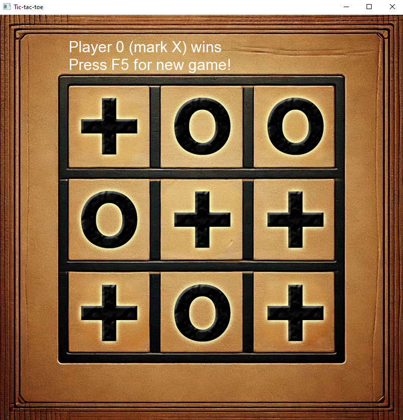

# 🎮 Tic-Tac-Toe in C++ with SFML

A simple yet complete implementation of the classic Tic-Tac-Toe game using C++ and the SFML (Simple and Fast Multimedia Library). This project is perfect for beginners who want to learn the basics of game development, event handling, and rendering in C++.

## 🚀 Features

- Classic 3x3 Tic-Tac-Toe grid
- Player vs Player mode
- Mouse interaction using SFML
- Simple game logic with win/draw detection
- Reset and replay functionality

## 📸 Demo

## 🛠️ Built With

- **C++** — Core language
- **[SFML](https://www.sfml-dev.org/)** — Graphics and event handling

## 📖 Tutorial Video

📺 Watch the full walkthrough on YouTube: [Let's Code Tic-Tac-Toe in C++ with SFML](https://youtu.be/nxkAJjXoP6w)